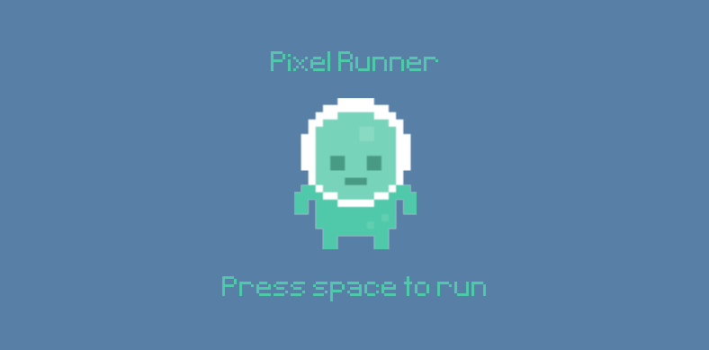
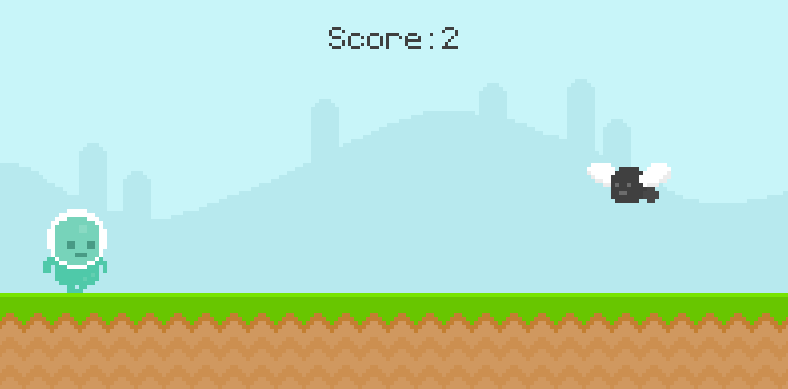

# Building a Pixel Runner Game with Pygame: A Step-by-Step Guide



## Introduction
In this tutorial, we'll create a simple but complete runner game using Pygame. The player controls a character that must jump over obstacles (snails and flying enemies) while the game keeps track of survival time as the score. This project will teach you fundamental game development concepts like sprite animation, collision detection, and game states.

## Prerequisites
- Basic Python knowledge
- Pygame library installed (`pip install pygame`)
- Basic understanding of object-oriented programming
- Game assets (images and sounds) in appropriate directories

## Project Structure
```
project_folder/
├── graphics/
│   ├── player/
│   │   ├── player_walk_1.png
│   │   ├── player_walk_2.png
│   │   ├── jump.png
│   │   └── player_stand.png
│   ├── fly/
│   │   ├── fly1.png
│   │   └── fly2.png
│   ├── snail/
│   │   ├── snail1.png
│   │   └── snail2.png
│   ├── Sky.png
│   └── ground.png
├── audio/
│   ├── jump.mp3
│   └── music.wav
├── font/
│   └── Pixeltype.ttf
└── main.py
```

## Step 1: Setting Up the Game Foundation
First, let's set up the basic game window and import necessary modules:

```python
import pygame
from sys import exit
from random import randint, choice

pygame.init()
screen = pygame.display.set_mode((800,400))
pygame.display.set_caption('Runner')
clock = pygame.time.Clock()
test_font = pygame.font.Font('font/Pixeltype.ttf', 50)
```

This creates an 800x400 pixel window and sets up the game clock for controlling frame rate.

## Step 2: Creating the Player Class
The player is the main interactive element in our game. We'll create it as a sprite class with animation and physics:

```python
class Player(pygame.sprite.Sprite):
    def __init__(self):
        super().__init__()
        # Player setup code...
```

Key features of the Player class:
1. Walking animation using two alternating frames
2. Jumping animation with a separate sprite
3. Gravity system for jumping mechanics
4. Sound effects for jumping

The player's movement is controlled by:
- Gravity constantly pulling the player down
- Jump force (-20) applied when spacebar is pressed
- Ground collision detection to prevent falling through the floor

## Step 3: Implementing Obstacles
Obstacles make the game challenging. We create two types: ground-based snails and flying enemies:

```python
class Obstacle(pygame.sprite.Sprite):
    def __init__(self,type):
        super().__init__()
        # Obstacle setup code...
```

Obstacle features:
1. Two types (fly and snail) with different Y-positions
2. Animation system similar to the player
3. Automatic movement from right to left
4. Self-destruction when moving off-screen
5. Random spawn positions along the X-axis

## Step 4: Setting Up Game States
The game alternates between two states:
1. Menu State (game_active = False):
   - Displays game title
   - Shows "Press space to run" message
   - After death, shows the player's score
   
2. Active Game State (game_active = True):
   - Player can move and jump
   - Obstacles spawn and move
   - Score increases with survival time

## Step 5: Implementing the Scoring System
The scoring system is time-based:
```python
def display_score():
    current_time = int(pygame.time.get_ticks() / 1000) - start_time
    score_surf = test_font.render(f'Score: {current_time}',False,(64,64,64))
    score_rect = score_surf.get_rect(center = (400,50))
    screen.blit(score_surf,score_rect)
    return current_time
```

The score represents the number of seconds survived since the game started.

## Step 6: Setting Up Animation Systems
The game uses three timer events for animations:
1. Obstacle spawning timer (1.5 seconds)
2. Snail animation timer (0.5 seconds)
3. Fly animation timer (0.2 seconds)

```python
obstacle_timer = pygame.USEREVENT + 1
pygame.time.set_timer(obstacle_timer,1500)

snail_animation_timer = pygame.USEREVENT + 2
pygame.time.set_timer(snail_animation_timer,500)

fly_animation_timer = pygame.USEREVENT + 3
pygame.time.set_timer(fly_animation_timer,200)
```

## Step 7: Implementing the Main Game Loop
The main game loop handles:
1. Event processing (quit, input, timers)
2. Game state updates
3. Drawing graphics
4. Collision detection
5. Score updating
6. Display refresh

```python
while True:
    for event in pygame.event.get():
        # Event handling...
    
    if game_active:
        # Game logic...
    else:
        # Menu logic...
    
    pygame.display.update()
    clock.tick(60)
```

## Step 8: Adding Polish
Final touches that make the game more engaging:
1. Background music that loops continuously
2. Jump sound effects
3. Smooth animations for all sprites
4. Clear visual feedback for game states
5. Score display after death

## Common Challenges and Solutions

### Challenge 1: Smooth Jumping
To create smooth jumping, we use a gravity system:
- Negative gravity for upward movement
- Gradually increasing gravity for falling
- Ground collision check to stop falling

### Challenge 2: Animation Timing
Animation timing is handled through:
- Separate timer events for different animations
- Frame indices that cycle through animation frames
- Delta time for smooth animation regardless of frame rate

### Challenge 3: Collision Detection
Collision detection uses Pygame's sprite collision system:
```python
def collision_sprite():
    if pygame.sprite.spritecollide(player.sprite,obstacle_group,False):
        obstacle_group.empty()
        return False
    return True
```

## Extending the Game
Possible enhancements:
1. Add power-ups
2. Implement different difficulty levels
3. Add high score system
4. Create different types of obstacles
5. Add particle effects
6. Implement double jump mechanics

## Conclusion
This project demonstrates fundamental game development concepts including:
- Sprite animation
- Physics systems
- Collision detection
- Game states
- Event handling
- Sound integration

The modular structure allows for easy expansion and modification, making it a good starting point for more complex games.

## Resources
- Pygame documentation: https://www.pygame.org/docs/
- Game development tutorials
- Asset creation tools
- Sound effect resources

Remember to handle asset loading errors gracefully and maintain consistent frame rates for smooth gameplay.


